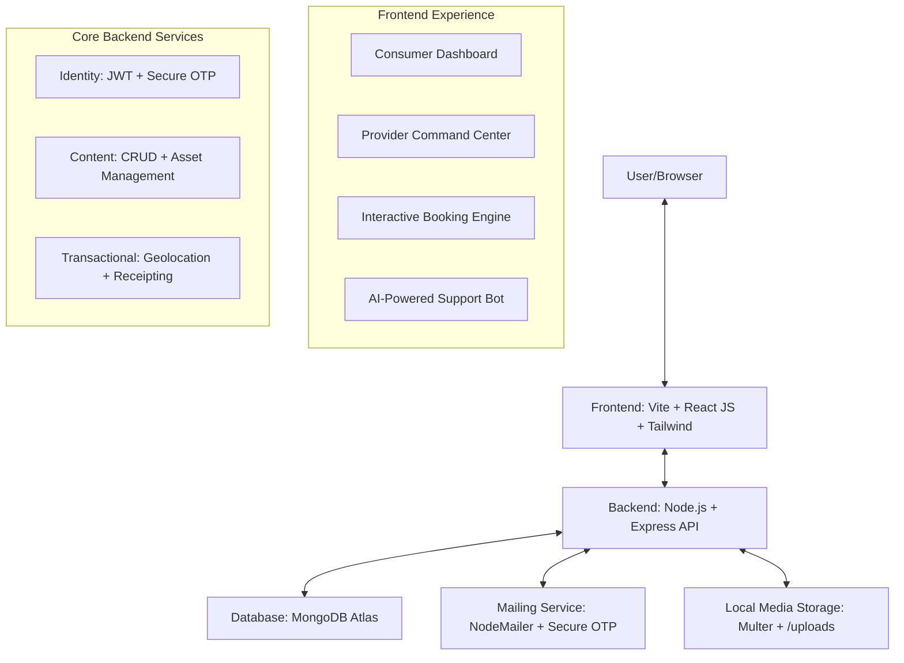

# 🏠 LocalLink - Premium Neighbourhood Service Marketplace 🚀

**LocalLink** is a high-performance, modern DXP (Digital Experience Platform) that bridges the gap between homeowners and trusted local professionals. Built with a focus on "Sexy Dark" aesthetics and real-time community interaction, it offers a seamless way to book verified experts for on-demand home maintenance.

---

## 🛠 Project Architecture

The LocalLink ecosystem is built on a scalable MERN stack, ensuring high concurrency and real-time response times.



---

## 🔥 Professional Tier Features

### 1. 🛡 Military-Grade Identity Management
*   **Dual-Role Ecosystem**: Seamless registration logic for both "Customers" and "Service Providers".
*   **OTP-Verified Onboarding**: Dynamic email-based verification (Sign-up phase) using **Nodemailer** for maximum security.
*   **Session Persistence**: Role-aware login engine that automatically routes users to their respective administrative dashboards.

### 2. 👷 Provider Command Center (CRM)
*   **Business Intelligence**: High-level dashboard for providers to manage job requests in real-time.
*   **Asset Management**: Integrated "Browse & Upload" feature for sharing real-time work portfolios.
*   **Dynamic Discovery**: Instant service publishing—once a provider adds a service, it appears globally without latency.

### 3. 🗺 Hyper-Local Booking & Fintech Logic
*   **Precision Geolocation**: Native browser API integration to "Lock Coordinates" for exact service delivery.
*   **HDFC Secure Payments**: Mock payment gateway with dynamic QR code generation (UPI: pprai1009@okhdfcbank).
*   **Automated Receipting**: Systematic receipt generation with 12-digit transaction verification simualtion.

### 4. 🤖 LocalLink Intelligence (AI Bot)
*   **Contextual Support**: Custom logic engine for answering service-specific queries instantly.
*   **Automated Ticket Escalation**: If the bot finds a query complex, it generates a unique Ticket ID and automates an email to support.

---

## 🏗 Setup & Deployment

### 1. Backend Integration
1. Configure environment variables in `/backend/.env`:
   ```env
   PORT=5000
   MONGO_URI=your_mongodb_cluster_uri
   JWT_SECRET=your_system_secret
   EMAIL_USER=your_verified_gmail_id
   EMAIL_PASS=your_app_specific_password
   ```
2. Initialize: `npm install` && `npm start`

### 2. Frontend Launch
1. Configure connectivity in `/frontend/.env`:
   ```env
   VITE_API_URL=http://localhost:5000/api
   ```
2. Launch: `npm install` && `npm run dev`

---

## 📂 System File Map

```text
LocalLink Hierarchy
├── frontend/               # Standard JavaScript Development Env
│   ├── src/                # Logic-heavy dynamic components
│   │   ├── components/     # UI Elements (Navbar, AI Bot, Spotlight Cards)
│   │   ├── pages/          # Full Views (User Dashboard, Booking Engine)
│   │   ├── data/           # AI Knowledge Base & Static Constants
│   │   └── api/            # Centralized Axios Hub
│   ├── index.html          # SPA Entry Point
│   └── package.json        # Unified Dependency Management
│
├── backend/                # Scalable Node.js + Express API
│   ├── Models/             # MongoDB Schemas (Consumer, Pro, Transaction)
│   ├── Controllers/        # Business Logic (Identity, Booking Logic)
│   ├── Routes/             # API Endpoints
│   ├── Middleware/         # Security & Multi-part File Handling
│   └── server.js           # Main Server entry point
│
└── README.md               # Operational Documentation
```

---

**Crafted with precision for the LocalLink ecosystem.**

© 2026 LocalLink - All Rights Reserved. Built for Kalpathon 2.0.
