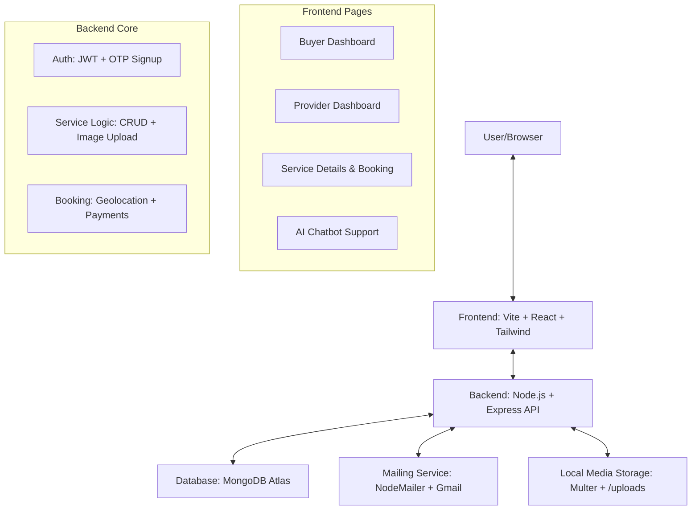

# 🏠 LocalLink - Neighbourhood Service Marketplace 🚀

**LocalLink** is a premium, high-performance service marketplace that connects homeowners with trusted local professionals (Electricians, Plumbers, Cleaners, etc.) for on-demand home maintenance.

---

## 🛠 Project Architecture (Graph Form)



---

## 🔥 Key Technical Features

### 1. 🛡 Robust Authentication
- **Dual-Role Signup**: Users choose between "Customer" or "Provider".
- **Secure Onboarding**: OTP-based email verification (Signup only) via **Nodemailer**.
- **State Persistence**: Roles are automatically detected at login to redirect users to their specific dashboard.

### 2. 👷 Provider Command Center
- **Service Management**: Providers can "Browse Device" to upload real-time photos of their work.
- **Business Profile**: Professional bios, years of experience, and shop names are customizable.
- **Real-Time Job Sync**: New services appear on the marketplace instantly upon publishing.

### 3. 🗺 Smart Geolocation & Booking
- **Precise Location**: Integration with browser Geolocation API to "Fetch Current Location" for bookings.
- **Visual Receipting**: Automatic HDFC-style dynamic receipts generated and emailed to both parties.
- **Status Control**: Providers can Accept or Decline jobs in real-time from their dashboard.

### 4. 🤖 AI Chatbot (LocalLink Bot)
- **Natural Interaction**: Custom AI logic to answer common service questions.
- **Ticket Generation**: Automatically generates a unique Ticket ID and offers email support if the bot can't resolve a query.

---

## 🏗 Setup & Installation

### 1. Backend Configuration
1. Create a `.env` file in `/backend`:
   ```env
   PORT=5000
   MONGO_URI=your_mongodb_uri
   JWT_SECRET=your_jwt_secret
   EMAIL_USER=your_gmail_id
   EMAIL_PASS=your_gmail_app_password
   ```
2. Run `npm install` and `npm start`.

### 2. Frontend Configuration
1. Create a `.env` file in `/frontend`:
   ```env
   VITE_API_URL=http://localhost:5000/api
   ```
2. Run `npm install` and `npm run dev`.

---

## 📁 Repository Structure

- `frontend/`: React components, Framer Motion animations, and API integration.
- `backend/`: Express routes, MongoDB models, and Multer file storage.
- `uploads/`: Dedicated local folder for provider-uploaded service and profile photos.

---

**Developed with ❤️ for the LocalLink Community.**
